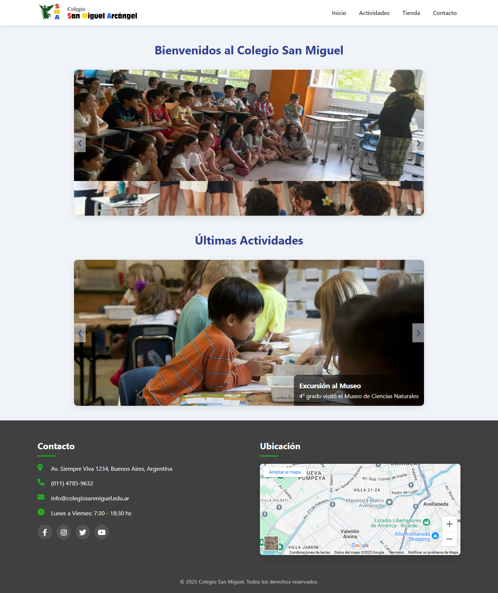
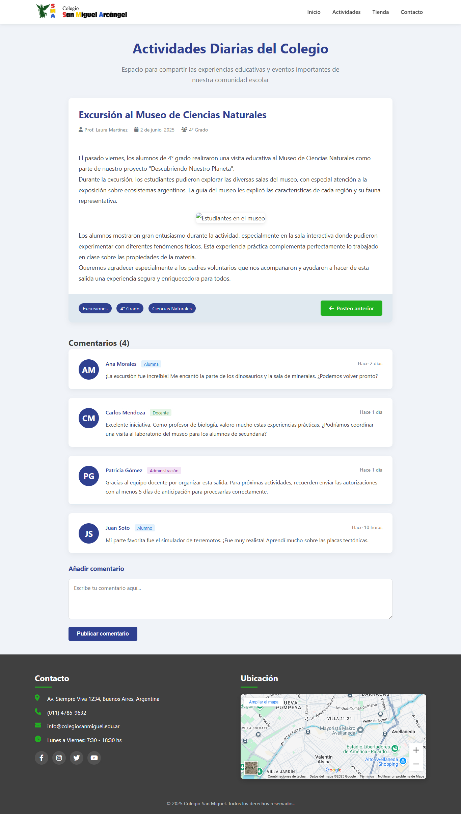
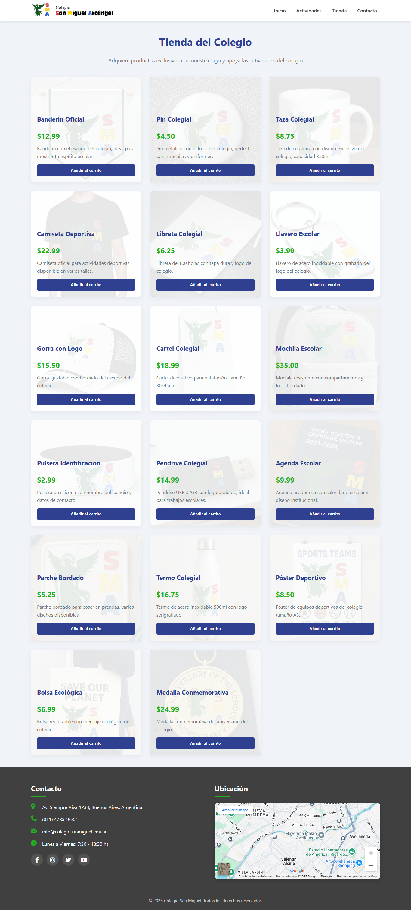
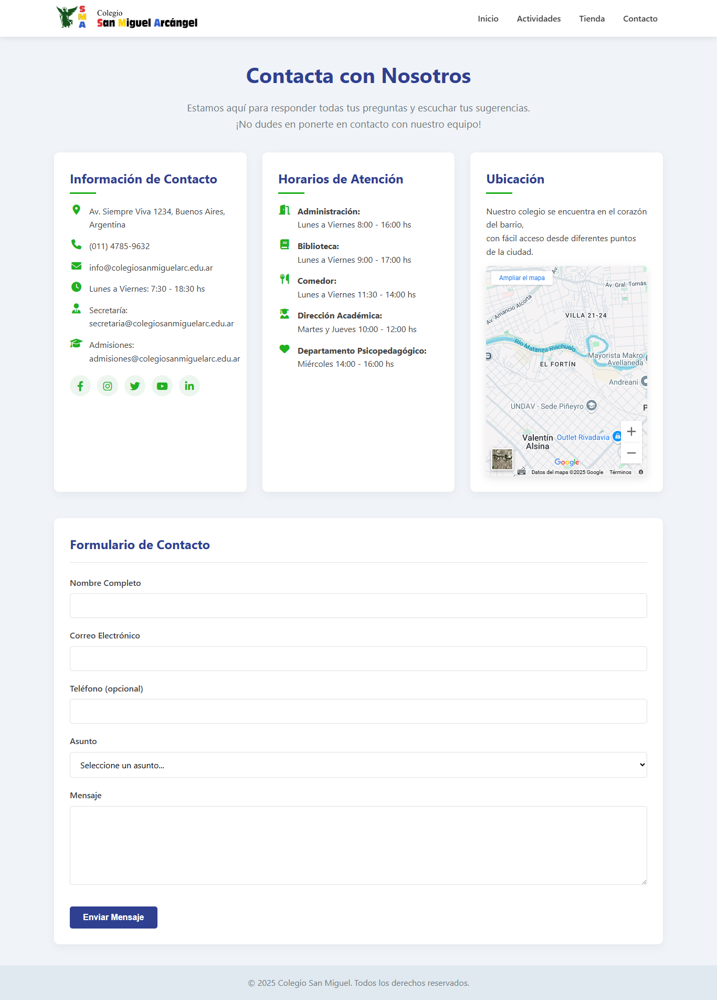

# js25019fin
Entrega final del Curso de Desarrollo web con Javascript para Talento Tech 2025

# 🏫 Sitio Web del Colegio San Miguel






## 📝 Descripción

Sitio web oficial del Colegio San Miguel, una plataforma informativa que muestra las actividades, eventos y servicios educativos de la institución. El proyecto incluye:

- Página principal con carruseles destacados
- Sección de actividades escolares
- Tienda virtual de productos institucionales
- Página de contacto e información

## 🚀 Tecnologías Utilizadas

### Frontend
- **HTML5** - Estructura semántica del sitio
- **CSS3** - Estilos personalizados con variables CSS
- **JavaScript** - Interactividad y funcionalidades dinámicas
  - Carruseles personalizados
  - Header dinámico que se reduce al hacer scroll
  - Carrito de compras para la tienda escolar

### Dependencias
- [Font Awesome](https://fontawesome.com/) - Iconos modernos
- [Google Maps API](https://developers.google.com/maps) - Integración de mapas

### Herramientas
- Diseño 100% responsive (adaptable a móviles y tablets)
- Transiciones CSS suaves
- Loader animado durante la carga

## 🛠️ Instalación y Configuración

1. **Clonar el repositorio**:
   ```bash
   git clone https://github.com/eleomarcol/js25019fin.git

2. **Visualizar el repositorio**:
   [Entrega final](https://eleomarcol.github.io/js25019fin/)  
